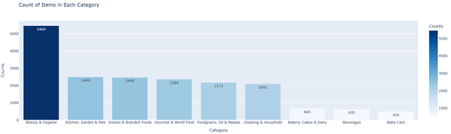
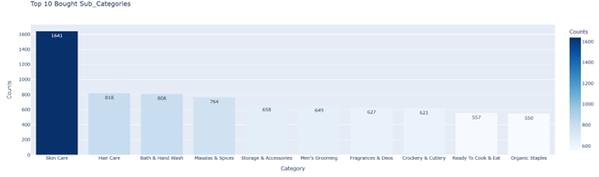
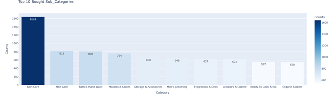
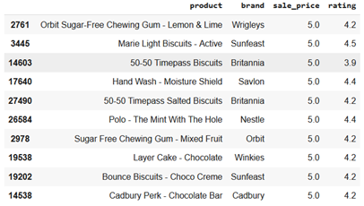
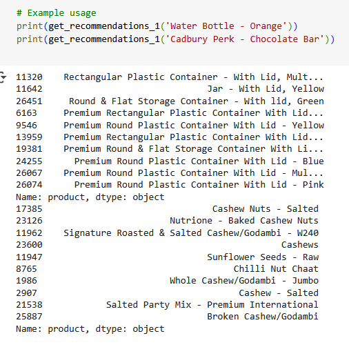
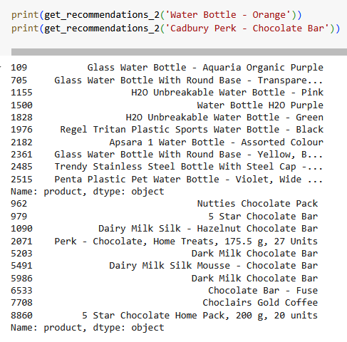
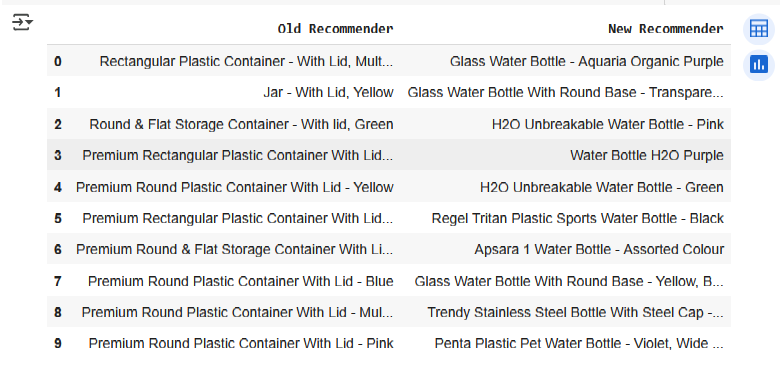
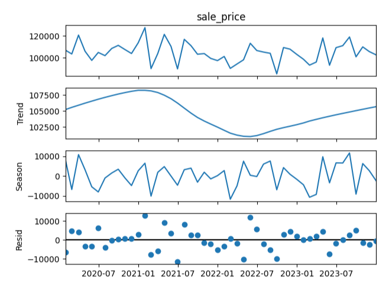

# INVENTORY SUPPLY OPTIMIZATION WITH DEMAND FORECASTING

# ABOUT
By utilizing cutting-edge machine learning (ML) algorithms, predictive analytics, and external data integration, the project "Inventory Supply Optimization with Demand Forecasting" seeks to improve the inventory management system for B2C companies. The technology proactively controls stock levels by precisely predicting demand, lowering the possibility of stockouts and overstocking and eventually increasing supply chain effectiveness and customer satisfaction. To improve demand forecasts and inventory optimization, the project combines time-series forecasting, regression analysis, and collaborative filtering.
# FEATURE
### Time-Series Forecasting (STL Decomposition)
Seasonal-Trend decomposition using Loess (STL) is employed to break down time-series data into its seasonal, trend, and residual components. This decomposition enables accurate demand forecasting by identifying underlying patterns in the data, such as seasonality, trends, and anomalies.

### Regression Analysis
Regression models are used to analyze the impact of promotions, price changes, and other factors on demand. By evaluating how these variables affect sales, businesses can better understand demand fluctuations.

### Collaborative Filtering
Collaborative filtering is used to identify product relationships based on customer behavior, recommending cross-category products that share similar characteristics. This improves product suggestions, catering to diverse customer preferences.

### Recommendation System
A hybrid recommendation system is implemented using both content-based and demographic filtering. Content-based filtering recommends products based on item attributes, while demographic filtering suggests products based on users' demographic profiles (age, location, etc.).

# REQUIREMENT

### HARDWARE ENVIRONMENT

* Processor	: Pentium Dual Core 2.00GH
* Hard disk	: 120 GB
* RAM	    : 2GB (minimum)
* Keyboard	: 110 keys enhanced

### SOFTWARE ENVIRONMENT

* Operating system	: Windows7 (with service pack 1), 8, 8.1 ,10 and 11
* Language		    : Python 

# FLOW DIAGRAM 

The inventory optimization system collects data from Google Drive, processes it for quality, and conducts EDA to identify trends. It then uses Demographic and Collaborative Filtering for personalized recommendations. STL decomposition of sales data aids accurate demand forecasting, which is integrated into a Recommendation System to adjust inventory and suggest products. This system optimizes stock levels, reduces inefficiencies, and enhances supply chain efficiency, improving customer satisfaction.

.png)

# SYSTEM ARCHITECTURE

The inventory management system collects and processes data from internal sources and external APIs for accurate forecasting. The Forecasting Model predicts demand, which the Optimization Model uses for resource management and logistics. Data is stored in a central Database for easy access by the User Interface, Report Generator, and Feedback Loop. An Alert System ensures real-time updates, supported by APIs, file exchanges, and message queues. This cycle enhances decision-making and system performance.

.png)

# OUTPUT
## EDA
### Category Plot Snippet

### Sub-Category Plot Snippet

### Top Recommended Plot Snippet

### Demographic Filter Snippet

## First Recommender System (TF-IDF)

## Second Recommender System (CountVectorizer)

## Comparison between Recommender 1 and 2

## STL Implementation

# RESULT / IMPACT
The project developed an advanced inventory management system that enhances demand prediction using time series analysis and cross-category correlation. This enables businesses to optimize inventory levels, reducing stockouts and overstocking. The intuitive user interface and adaptability, refined through real-time feedback, make it user-friendly and responsive to market changes. Key features such as machine learning integration and automated feedback loops improve decision-making, operational efficiency, and cost savings.

Future enhancements include a web application for better accessibility, integration with ERP/CRM systems for seamless data exchange, advanced data visualizations for deeper insights, and AI-driven decision-making for automated recommendations. These improvements will further enhance the system’s accuracy, efficiency, and responsiveness, ensuring businesses remain competitive.
# REFERENCES 

P. S and P. D. S, "A Hybrid Demand Forecasting for Intermittent Demand Patterns using Machine Learning Techniques," 2022 1st International Conference on Computational Science and Technology (ICCST), CHENNAI, India, 2022.
 

J. -j. Gao, Y. Zheng and X. Mao, "A joint decision model of dynamic pricing and dynamic inventory in an apparel supply chain with demand learning," 2010 International Conference on Logistics Systems and Intelligent Management (ICLSIM), Harbin, China, 2010.
 

W. Wang, "An inventory optimization model based on BP neutral network," 2011 IEEE 2nd International Conference on Software Engineering and Service Science, Beijing, China, 2011.
 

R. K. Meena and M. Rizwanullah, "An Optimization of Inventory Control in Supply Chain Under Time Varying Holding Costs with Exponential Demand Rate," 2024 3rd International Conference on Computational Modelling, Simulation and Optimization (ICCMSO), Phuket, Thailand, 2024.
 

